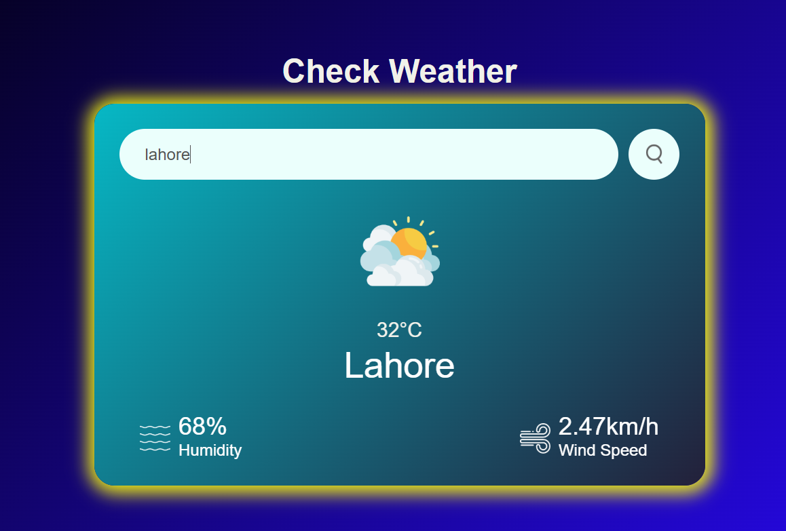

# 🌦️ Weather App

A responsive weather application built with **HTML**, **CSS**, and **JavaScript** that fetches real-time weather data using the [cb5c9a3bc8548c710bf98a2aa92dbbc7](https://openweathermap.org/api). Users can search any city and get current weather details like temperature, humidity, wind speed, and weather condition icon.

---
🌐 [Live Demo](https://your-vercel-link-here.vercel.app)
🖼️ 

---

## ⚙️ Features

- 🔍 Search weather by city name
- 📡 Real-time weather data with API
- 🌡️ Temperature in Celsius
- 💨 Wind speed and 💧 humidity details
- 🌈 Weather icons for condition
- 🔁 Responsive on all screen sizes
- ❌ Error handling for invalid city names

---

## 🚀 Technologies Used

- HTML5
- CSS3 (Flexbox, Media Queries)
- JavaScript (Fetch API, DOM Manipulation)
- OpenWeatherMap API

---

## 🧠 How It Works

1. User enters city name in the input box.
2. JavaScript uses `fetch()` to request weather data from the OpenWeatherMap API.
3. On success, weather data is shown with custom icon and text.
4. On error (like invalid city), an error message is displayed.
5. Fully responsive layout adapts across all screen sizes.

---

## 🛠️ Installation & Setup

Clone this repository to your local machine:
```bash
git clone https://github.com/connect-aima/Weather-app.git
